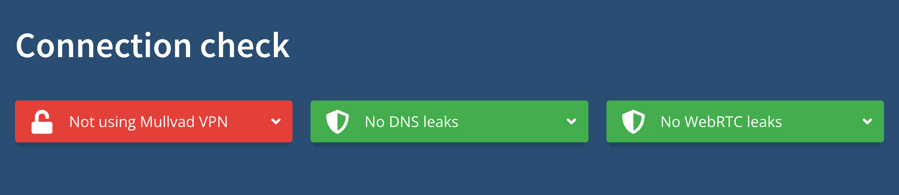

<!--
Title: How to harden Firefox
Description: Learn how to harden Firefox to increase privacy and security.
Publication date: 2025-05-11T11:03:11.988Z
Pinned: 1
-->

## Setup

### Step 1: install [Firefox](https://www.mozilla.org/en-US/firefox/new/)

Go to [https://www.mozilla.org/en-US/firefox/new/](https://www.mozilla.org/en-US/firefox/new/), download and install Firefox.

### Step 2: add [arkenfox/user.js](https://github.com/arkenfox/user.js/) to profile

> Heads-up: see [user.js](https://github.com/arkenfox/user.js/blob/master/user.js) to learn more about settings.

#### Start Firefox, paste “about:profiles” in address bar and press <kbd>Enter</kbd>.

#### Find default profile root directory and copy path to clipboard.

#### Download `user.js` to default profile root directory.

> Heads-up: replace `/Users/sunknudsen/Library/Application Support/Firefox/Profiles/rzrw17yo.default-release` with default profile root directory copied to clipboard.

```console
$ cd "/Users/sunknudsen/Library/Application Support/Firefox/Profiles/rzrw17yo.default-release"

$ curl --fail --remote-name https://raw.githubusercontent.com/arkenfox/user.js/refs/heads/master/user.js
```

### Step 3: append [user-overrides.js](./user-overrides.js) to `user.js`

> Heads-up: enables [Mullvad DNS over HTTPS](https://mullvad.net/en/help/dns-over-https-and-dns-over-tls/).

```console
$ curl --fail --remote-name https://sunknudsen.com/guides/how-to-configure-firefox-for-privacy-and-security/user-overrides.js

$ cat user-overrides.js >> user.js
```

### Step 4 (optional): enable [Mullvad SOCKS5 proxy](https://mullvad.net/en/help/socks5-proxy) kill switch (disabled by default, Mullvad [app](https://mullvad.net/en/download) and [subscription](https://mullvad.net/en/pricing) required)

Open `user.js` and `user-overrides.js` using text editor and set `network.proxy.type` to `1`.

### Step 5: restart Firefox

### Step 6: install [Firefox Multi-Account Containers](https://addons.mozilla.org/en-US/firefox/addon/multi-account-containers/) and [Privacy Badger](https://addons.mozilla.org/en-US/firefox/addon/privacy-badger17/) extensions

#### Go to [https://addons.mozilla.org/en-US/firefox/addon/multi-account-containers/](https://addons.mozilla.org/en-US/firefox/addon/multi-account-containers/) and click “Add to Firefox”.

#### Go to [https://addons.mozilla.org/en-US/firefox/addon/privacy-badger17/](https://addons.mozilla.org/en-US/firefox/addon/privacy-badger17/) and click “Add to Firefox”.

> Heads-up: when asked to allow extension to run in private windows, check box and click “Okay”.

### Step 7: set default search engine to DuckDuckGo

Paste “about:preferences#search” in address bar, press <kbd>Enter</kbd> and set default search engine to “DuckDuckGo”.

### Step 8: uncheck all search shortcuts

Paste “about:preferences#search” in address bar, press <kbd>Enter</kbd> and uncheck all search shortcuts.

### Step 9: configure containers (see episode)

### Step 10: check for DNS and WebRTC leaks

Go to [https://mullvad.net/en/check](https://mullvad.net/en/check).



No DNS leaks

No WebRTC leaks

👍

---

## Usage

### Temporarily disable cookie and site data deletion (useful when Firefox is restarted to install update or one wishes to reboot computer while persisting Firefox sessions)

> Heads-up: “Delete cookies and site data when Firefox is closed” will be enabled again next time Firefox starts.

Start Firefox, paste “about:preferences#privacy” in address bar and press <kbd>Enter</kbd>.

Uncheck “Delete cookies and site data when Firefox is closed”.

---

## Want things back the way they were before following this guide?

### Delete `user.js` and `user-overrides.js` and set Firefox settings as they were before following guide.
